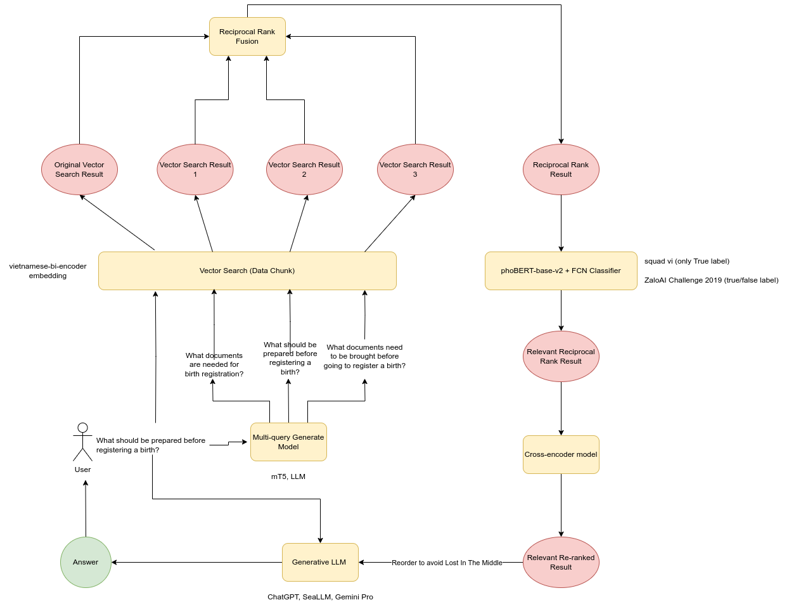

# RAG For Question&Answer on Can Tho Public Services / Adminstrative Procedures

Building a Microservices system implement the RAG approach for Question&Answer on Can Tho Public Services and Adminstrative Procedures.

## Introduction

**What is Can Tho Public Services?**

Can Tho Public Services is a system that provides public services and administrative procedures for citizens and organizations in Can Tho city. The system is designed to help people access public services and administrative procedures more easily and conveniently.

In general, the public services and administrative procedures are provided by different departments and agencies in Can Tho city. Each procedure has its own process and requirements.

**The solutions for Q&A on Can Tho Public Services**

The RAG approach is used to build a system that can answer questions about public services and administrative procedures in Can Tho city. The system is designed to provide accurate and reliable information to users.

## Authors

- **Tran Gia Huy** - _Initial work_ - [TranHuy2k2](https://github.com/TranHuy2k2)

See also the list of [contributors](https://github.com/TranHuy2k2/cantho-public-services/graphs/contributors) who participated in this project.

## License

This project is licensed under the GNU License - see the [LICENSE](LICENSE) file for details
